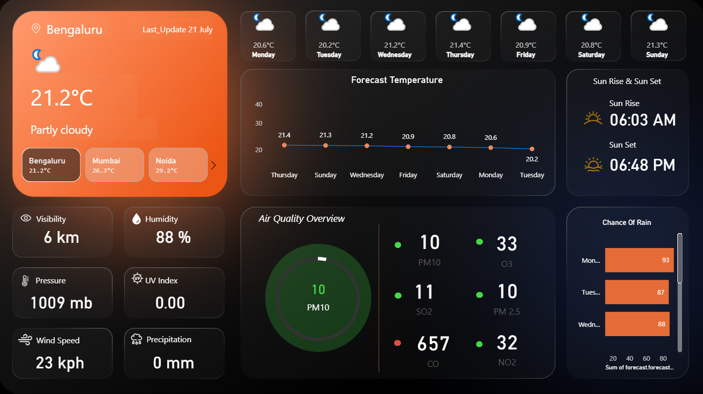

# 🌦 Weather Forecast Dashboard using API & Power BI

This project provides an interactive and dynamic weather forecasting dashboard using real-time weather API. The data is processed using Power Query and visualized through Power BI.

---

## 📌 Features

- ✅ **Live Weather API Integration**  
  Real-time data fetched using Weather API (temperature, humidity, wind, rain probability, and more)

- 🧹 **Power Query for Data Transformation**  
  Cleaned and transformed data using Power BI’s Power Query Editor

- 🌆 **City-Wise Selection**  
  Dropdown filter to choose cities like **Patna, Mumbai, Bengaluru, Noida, etc.**

- 📈 **7-Day Forecast Chart**  
  Forecasted temperature trends and rain predictions shown via line and bar charts

- 🏙️ **Air Quality Index Visualization**  
  AQI components like PM2.5, PM10, CO, NO2, SO2, O3 shown both numerically and graphically

- 🌅 **Sunrise & Sunset Info**  
  Day-wise dynamic display of sunrise and sunset timings

- 📱 **User-Friendly Interface**  
  Clean UI with interactive slicers, data cards, and visual charts

---

## 📊 Technologies Used

| Tool         | Usage                                  |
|--------------|-----------------------------------------|
| Power BI     | Dashboard development                   |
| Power Query  | Data import, cleaning & transformation  |
| Weather API  | Real-time data source                   |

---

## 🚀 How to Use

1. Clone or download this repository  
2. Open the `Weather_Report.pbix` file in Power BI Desktop  
3. Click on the **dropdown filter** to select your city  
4. Refresh the dataset to get the latest weather updates

---

## 🏙️ How to Add a New City

1. Go to Power Query Editor in Power BI  
2. Find the **City** parameter or step  
3. Add or change the city name (ensure correct spelling)  
4. Click **Close & Apply**  
5. Dashboard will auto-update with new city data

---

## 📂 Project Structure
Weather-Api-Report/
│
├── Weather_Report.pbix ← Main Power BI file
├── Screenshot.png ← Dashboard preview image
└── README.md ← You're here!

